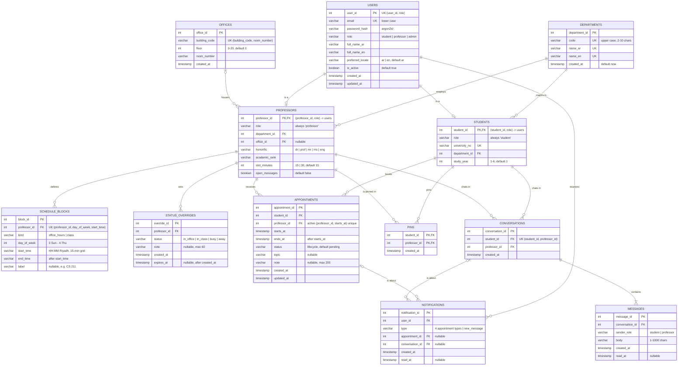

# Mawjood: ER diagram

Source of truth: [`db/schema.sql`](../db/schema.sql). This file must match it table for table and column for column; update both together. `python3 scripts/check_db.py` fails if they drift apart.

A rendered export for reports is in [`er-diagram.png`](er-diagram.png). Regenerate it after changing the diagram.

## Diagram

## Relationships: cardinality and participation

"Total" participation means every row of that entity must take part (enforced by `NOT NULL` foreign keys); "partial" means it may not.

| Relationship | Cardinality | Participation | Enforced by |
|---|---|---|---|
| User **is a** Student | 1 : 0..1 | Student total; User partial | `students (student_id, role)` FK to `users (user_id, role)`, PK on `student_id` |
| User **is a** Professor | 1 : 0..1 | Professor total; User partial | Same composite-FK pattern; the `role` value makes the subtypes disjoint |
| Department **employs** Professor | 1 : 0..N | Professor total; Department partial (BUS has none) | `professors.department_id NOT NULL`, `ON DELETE RESTRICT` |
| Department **has major** Student | 1 : 0..N | Student total; Department partial | `students.department_id NOT NULL`, `ON DELETE RESTRICT` |
| Office **houses** Professor | 0..1 : 0..N | Both partial (office 7 is empty; office may be unset) | `professors.office_id` nullable, `ON DELETE SET NULL` |
| Professor **defines** ScheduleBlock | 1 : 0..N | Block total; Professor partial | `NOT NULL` FK, `ON DELETE CASCADE` |
| Professor **sets** StatusOverride | 1 : 0..N | Override total; Professor partial | `NOT NULL` FK, `ON DELETE CASCADE` |
| Student **books** Appointment | 1 : 0..N | Appointment total; Student partial | `NOT NULL` FK, `ON DELETE CASCADE` |
| Professor **receives** Appointment | 1 : 0..N | Appointment total; Professor partial | `NOT NULL` FK, `ON DELETE CASCADE` |
| Student **pins** Professor | M : N (via `pins`) | Both partial | Composite PK `(student_id, professor_id)` |
| Student **chats with** Professor | M : N (via `conversations`), at most one conversation per pair | Both partial | `UNIQUE (student_id, professor_id)` |
| Conversation **contains** Message | 1 : 1..N | Message total; Conversation total (the API creates a conversation together with its first message) | `NOT NULL` FK, `ON DELETE CASCADE`; the 1..N minimum is API-enforced and seed-checked |
| User **receives** Notification | 1 : 0..N | Notification total; User partial | `NOT NULL` FK, `ON DELETE CASCADE` |
| Notification **is about** Appointment or Conversation | N : 0..1 each, exactly one of the two | Notification total over the pair | `ck_notifications_reference` CHECK |

## Specialization (ISA)

`users` is the supertype of `students` and `professors`.

- **Disjoint**: an account is at most one subtype. Each subtype table stores a constant `role` column (`CHECK (role = 'student')`), and its foreign key references `users (user_id, role)`. A student row can therefore only point at an account whose role is `student`, and that role cannot change while the subtype row exists.
- **Partial**: admin accounts (`role = 'admin'`) have no subtype row.

## Weak or associative entities

- `pins` and `conversations` resolve M:N relationships between students and professors. `pins` has a composite primary key. `conversations` has a surrogate key, because messages and notifications reference it, plus a `UNIQUE` pair.
- `schedule_blocks`, `status_overrides`, `appointments` and `messages` have surrogate keys but depend on their owner for existence (`ON DELETE CASCADE`).
