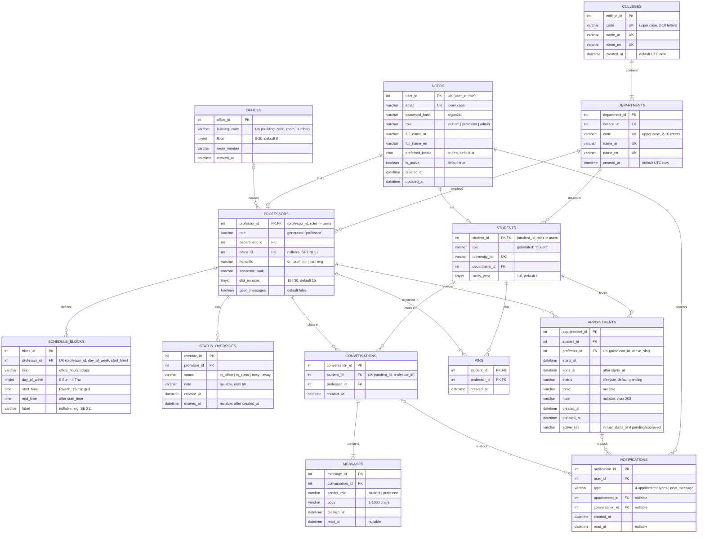

# Mawjood: ER diagram

Source of truth: [`db/schema.sql`](../db/schema.sql) (MySQL 8.0). This file must match it table for table and column for column; update both together. `python3 scripts/check_db.py` fails if they drift apart.

This file has three parts:
1. the Mermaid diagram (crow's-foot notation, all columns);
2. a cardinality and participation table;
3. a [Chen-notation description](#chen-notation-description) for redrawing the diagram by hand (entities, attributes with underlined primary keys, relationships with cardinality and participation on both sides).

A rendered export of the Mermaid diagram is in [`er-diagram.png`](er-diagram.png). Regenerate it after changing the diagram.

## 1. Diagram (crow's-foot)

## 2. Relationships: cardinality and participation

"Total" participation means every row of that entity must take part (enforced by `NOT NULL` foreign keys); "partial" means it may not.

| Relationship | Cardinality | Participation | Enforced by |
|---|---|---|---|
| User **is a** Student | 1 : 0..1 | Student total; User partial | `students (student_id, role)` FK to `users (user_id, role)`; `role` is generated as `'student'` |
| User **is a** Professor | 1 : 0..1 | Professor total; User partial | Same pattern with `'professor'`; the fixed role values make the subtypes disjoint |
| College **contains** Department | 1 : 1..N | Department total; College total (every college has departments; the seed checks it) | `departments.college_id NOT NULL`, `ON DELETE RESTRICT` |
| Department **employs** Professor | 1 : 0..N | Professor total; Department partial (BM and departments 7-12 have none) | `professors.department_id NOT NULL`, `ON DELETE RESTRICT` |
| Department **has major** Student | 1 : 0..N | Student total; Department partial | `students.department_id NOT NULL`, `ON DELETE RESTRICT` |
| Office **houses** Professor | 0..1 : 0..N | Both partial (office 7 is empty; a professor may have no office) | `professors.office_id` nullable, `ON DELETE SET NULL` |
| Professor **defines** ScheduleBlock | 1 : 0..N | Block total; Professor partial | `NOT NULL` FK, `ON DELETE CASCADE` |
| Professor **sets** StatusOverride | 1 : 0..N | Override total; Professor partial | `NOT NULL` FK, `ON DELETE CASCADE` |
| Student **books** Appointment | 1 : 0..N | Appointment total; Student partial | `NOT NULL` FK, `ON DELETE CASCADE` |
| Professor **receives** Appointment | 1 : 0..N | Appointment total; Professor partial | `NOT NULL` FK, `ON DELETE CASCADE` |
| Student **pins** Professor | M : N (via `pins`) | Both partial | Composite PK `(student_id, professor_id)` |
| Student **chats with** Professor | M : N (via `conversations`), at most one conversation per pair | Both partial | `UNIQUE (student_id, professor_id)` |
| Conversation **contains** Message | 1 : 1..N | Message total; Conversation total (the API creates a conversation together with its first message) | `NOT NULL` FK, `ON DELETE CASCADE`; the 1..N minimum is API-enforced and seed-checked |
| User **receives** Notification | 1 : 0..N | Notification total; User partial | `NOT NULL` FK, `ON DELETE CASCADE` |
| Notification **is about** Appointment or Conversation | N : 0..1 each, exactly one of the two | Notification total over the pair | `ck_notifications_reference` CHECK |

## 3. Chen-notation description

Conventions for redrawing:
- **Rectangle** = entity; **diamond** = relationship; **ellipse** = attribute.
- **Underlined** attribute = primary key (shown here as <ins>underlined</ins>).
- **Dashed ellipse** = derived attribute (computed, not stored).
- **Double line** = total participation; **single line** = partial participation.
- Cardinality labels (1, N, M) sit on the lines next to the entities.

Foreign-key columns are not drawn as attributes in Chen notation: they *are* the relationship lines. So each entity below lists only its own attributes.

### 3.1 Entities and attributes

| Entity | Attributes (primary key underlined) | Derived attributes (dashed ellipse) |
|---|---|---|
| COLLEGE | <ins>college_id</ins>, code, name_ar, name_en, created_at | none |
| DEPARTMENT | <ins>department_id</ins>, code, name_ar, name_en, created_at | none |
| USER | <ins>user_id</ins>, email, password_hash, role, full_name_ar, full_name_en, preferred_locale, is_active, created_at, updated_at | none |
| STUDENT (subclass of USER) | inherits <ins>user_id</ins>; university_no, study_year | none |
| PROFESSOR (subclass of USER) | inherits <ins>user_id</ins>; honorific, academic_rank, slot_minutes, open_messages | effective_status, last_updated (from overrides, schedule and the clock) |
| OFFICE | <ins>office_id</ins>, building_code, floor, room_number, created_at | none |
| SCHEDULE_BLOCK | <ins>block_id</ins>, kind, day_of_week, start_time, end_time, label | bookable_slots (block split by slot_minutes) |
| STATUS_OVERRIDE | <ins>override_id</ins>, status, note, created_at, expires_at | none |
| APPOINTMENT | <ins>appointment_id</ins>, starts_at, ends_at, status, topic, note, created_at, updated_at | active_slot (starts_at while pending/approved; a virtual column in MySQL) |
| CONVERSATION | <ins>conversation_id</ins>, created_at | none |
| MESSAGE | <ins>message_id</ins>, sender_role, body, created_at, read_at | none |
| NOTIFICATION | <ins>notification_id</ins>, type, created_at, read_at | text (rendered in the reader's language) |

Alternate keys (also unique, but not underlined):
- COLLEGE: code, name_ar, name_en
- DEPARTMENT: code, name_ar, name_en
- USER: email
- STUDENT: university_no
- OFFICE: (building_code, room_number)
- SCHEDULE_BLOCK: (professor, day_of_week, start_time)
- CONVERSATION: (student, professor)

All entities are strong entities with their own keys; none is weak.

### 3.2 Specialization (EER extension of Chen)

- USER is the superclass. STUDENT and PROFESSOR are subclasses.
- Draw a circle marked **d** (disjoint): an account is never both.
- Draw a **single** line from USER to the circle (partial specialization): admin accounts belong to neither subclass.
- The defining attribute is USER.role.

### 3.3 Relationships

Each line reads: relationship (diamond), the two entities with their cardinality, then each side's participation (double line = total, single line = partial), and any relationship attributes.

| Relationship | Entity A (cardinality) | Entity B (cardinality) | Participation of A | Participation of B | Relationship attributes |
|---|---|---|---|---|---|
| CONTAINS_DEPT | COLLEGE (1) | DEPARTMENT (N) | **total** (every college has departments) | **total** (every department has one college) | none |
| EMPLOYS | DEPARTMENT (1) | PROFESSOR (N) | partial (a department may have no professors) | **total** (every professor has one department) | none |
| MAJORS_IN | DEPARTMENT (1) | STUDENT (N) | partial | **total** | none |
| HOUSES | OFFICE (1) | PROFESSOR (N) | partial (an office may be empty) | partial (a professor may have no office) | none |
| DEFINES | PROFESSOR (1) | SCHEDULE_BLOCK (N) | partial | **total** | none |
| SETS | PROFESSOR (1) | STATUS_OVERRIDE (N) | partial | **total** | none |
| BOOKS | STUDENT (1) | APPOINTMENT (N) | partial | **total** | none |
| RECEIVES | PROFESSOR (1) | APPOINTMENT (N) | partial | **total** | none |
| PINS | STUDENT (M) | PROFESSOR (N) | partial | partial | created_at (when the pin was made) |
| STARTS | STUDENT (1) | CONVERSATION (N) | partial | **total** | none |
| ANSWERS | PROFESSOR (1) | CONVERSATION (N) | partial | **total** | none |
| CONTAINS | CONVERSATION (1) | MESSAGE (N) | **total** (at least one message) | **total** | none |
| NOTIFIES | USER (1) | NOTIFICATION (N) | partial | **total** | none |
| ABOUT_APPOINTMENT | APPOINTMENT (1) | NOTIFICATION (N) | partial | partial (only appointment notifications) | none |
| ABOUT_CONVERSATION | CONVERSATION (1) | NOTIFICATION (N) | partial | partial (only message notifications) | none |

Constraints to note beside the diagram:
- **CONVERSATION** together with STARTS and ANSWERS forms at most one conversation per student-professor pair (`UNIQUE (student_id, professor_id)`). It is drawn as an entity rather than an M:N diamond because MESSAGE and NOTIFICATION relate to it.
- **NOTIFICATION** takes part in exactly one of ABOUT_APPOINTMENT and ABOUT_CONVERSATION, chosen by its type (`ck_notifications_reference`).
- **PINS** is the only relationship with its own attribute. In the relational schema it becomes the `pins` table with composite key (student_id, professor_id).

## 4. Specialization in the relational schema

`users` is the supertype of `students` and `professors`.

- **Disjoint**: each subtype table has a stored generated column `role` fixed to `'student'` or `'professor'`. Its foreign key references `users (user_id, role)`, so:
  - a student row can only point at an account whose role is `student`;
  - `ON UPDATE RESTRICT` stops that role from changing while the subtype row exists.
- **Partial**: admin accounts (`role = 'admin'`) have no subtype row.

## 5. Views (derived, not entities)

The three views in `db/queries.sql` store nothing. They are computed from the tables above whenever they are read, so they add no entities or relationships to the diagram and cannot break 3NF.

- **`v_professor_current_status`:** each professor's effective status right now. Sources: `professors`, `schedule_blocks`, `status_overrides`.
- **`v_professors_in_office_now`:** the professors in their office now, with their room. Sources: the status view, `users`, `departments`, `offices`.
- **`v_upcoming_appointments`:** pending and approved appointments that have not started. Sources: `appointments`, `users`.

